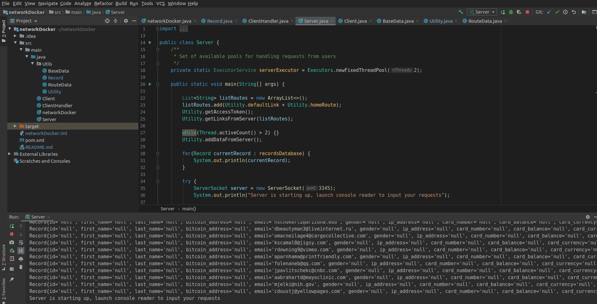
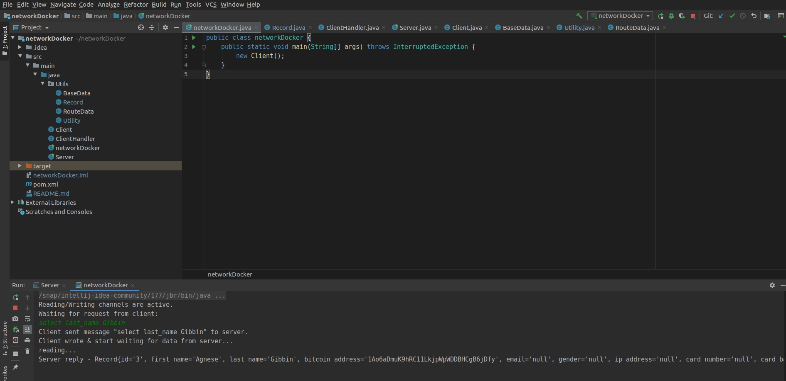

# Docker server project - Lab 1

Here is described entire principle of work for first laboratory work with networks. In order to make this description full and close all questions, I attached some code parts to the explanation.

## Data from server

First problem that I faced was creation of database that will keep all data from server in one place. Let's ignore process of connection to the server at this stage, we'll come back to it later.

Analyze of data shown that there are XML, YAML, JSON, and CSV files that kept some records. For getting this data we needed to create a class, each instance of which will keep one such record from file.

For this purpose, was created class **Record** with next fields:

```java
public class Record {

    private String id;
    private String first_name;
    private String last_name;
    private String bitcoin_address;
    private String email;
    private String gender;
    private String ip_address;
    private String card_number;
    private String card_balance;
    private String card_currency;
    private String organization;
    private String full_name;
    private String employee_id;
    private String username;
    private String created_account_data;
```

All fields are made private for internal protection of data from getting external access not using getters and setters. For correct output of this instance in string was made override of **toString()** method for this class. 

Also, there are fields which specify type of data and internal links from server, where can be another data. For having all links in memory and having types of files was created class **BaseData**:

```java
public class BaseData {
    private String msg;
    private Map<String, String> link;
    private String data;
    private String mime_type;
```

Here we also have a set of getters and setters for getting access to data.

And in the end needs to be created database, that will take all data from server and keep it. For this purpose is created class **RouteData**:

```java
public class RouteData extends BaseData {
    private List<Record> recordList;

    public List<Record> getRecordList() {
        return recordList;
    }

    public void setRecordList(List<Record> recordList) {
        this.recordList = recordList;
    }
}
```

**RouteData** extends class **BaseData**. It connects fields and classes from both classes. Using those classes we can get all data from server.

## Singleton class for processing all data from server

There are several problems that required solution:

- all data from server needs to deserialized from file formats described previously and transformed into form, that can be accepted by database;
- for communication with server is required access token that can be obtained from _/register_ link and needs to be used in establishing all connections.
- program must search data in all links of server, which program can get from processing of files on server;
- program needs to take all data as fast, as possible, because there is a timeout of getting data from server (multithreading required).

To solve all those problems is created singleton class **Utility** that has all required functionaliity. Let's look inside some funtions to understand how it all works.

First function that is needed - `getAccessToken()`:

```java
    public static void getAccessToken(){
        String registerRoute = "/register";
        CloseableHttpClient client = HttpClientBuilder.create().build();
        HttpGet request = new HttpGet(defaultLink + registerRoute);

        try {
            HttpResponse response = client.execute(request);

            ResponseHandler<String> handler = new BasicResponseHandler();
            String text = handler.handleResponse(response);
            accessToken = text.split("\"")[3];
        } catch (IOException e) {
            System.out.println("Error in getting access token. Check your connection!\n\n" + e);
        }
    }
```

Function uses constant `defaultLink` that sets general route for all links and connects to the registration route. Function creates internal `HttpClient` that will make a request to server. Then is launched handler that will find access token and write it as a constant for all next connections. 

Second step is getting content from the page for next analysis. For such purpose is used `getDataFromPage()`:

```java
    private static String getDataFromPage(String link) {
        CloseableHttpClient client = HttpClientBuilder.create().build();
        HttpGet request = new HttpGet(link);
        request.addHeader("X-Access-Token", accessToken);
        String contentOfPage = null;

        try{
            HttpResponse response = client.execute(request);
            ResponseHandler<String> handler = new BasicResponseHandler();
            contentOfPage = handler.handleResponse(response);
            client.close();
        } catch (IOException e) { System.err.println("Error reading content of page, shutting program down.\n" + e); }

        return contentOfPage;
    }
```

Here function uses previously established access token to connect to page, using link-argument. Function returns String-formatted content of page.

Next step: come through all links and get data from those pages. Here appears one of the main functions - `getLinksFromServer`:

```java
    public static void getLinksFromServer(List<String> availableRoutes) {
        if(availableRoutes != null && availableRoutes.size() > 0) {
            for(int i = 0; i < availableRoutes.size(); i++){
                //considering that lambdas require work with final variables, was used this field
                final int finalI = i;
                new Thread(() -> {
                    ObjectMapper objectMapper = new ObjectMapper();
                    String currentRoute = availableRoutes.get(finalI);
                    try {
                        RouteData routeData = objectMapper.readValue(Utility.getDataFromPage(currentRoute), RouteData.class);
                        if(!homeLinkForChecking.equals(currentRoute)){
                            allDataFromServer.add(routeData);
                        }
                        if(routeData.getLink() != null && routeData.getLink().size() > 0){
                            List<String> innerList = new ArrayList<>(routeData.getLink().values());
                            getLinksFromServer(innerList.stream().map(route ->
                                    route = defaultLink + route)
                                    .collect(Collectors.toList()));
                        }
                    } catch (IOException e) {
                        System.err.println("Error reading links from server, shutting program down.\n" + e);
                    }
                }).start();
            }
        } else System.err.println("No routes, check your connection or server");
    }
```

Function gets as an argument list of all available at the moment links from server. It checks if there are any links available at the moment and starts work with them (if they are not null, of course). 

Function reads all data from page, transforming it in form of class `RouteData`. Program makes sure, that this is not _home_ link and writes this data in database of all data from server. If current page has links to other routes, then program acts in next way:

- it creates inner list of links, writing all obtained from page links;
- recursevly calls itself, but transmitting in this time as argument list of links from current page.

Such a reqursive behaviour evades "hardcoding" of all links from server and make entire process dynamical. The last touch is that this process needs to be as fast, as possible, because there is timeout of connection on server. That's why each call of this function starts new thread, allowing parallel execution of function for several links.

Ok, all data is recorded and now can be launched process of data analysis. There are several functions for deserialization of all data. Those functions are similar to this one:

```java
    private static List<Record> getDataFromJson (RouteData data) {
        try{
            return new ObjectMapper().readValue(data.getData().replaceAll(",]", "]"), new TypeReference<ArrayList<Record>>(){});
        } catch (JsonProcessingException e) {
            System.err.println("Error in reading from JSON file, check integrity or format of file.\n" + e);
        }

        return null;
    }
```

Here function refers to the `ObjectMapper()` that handles data in JSON format and transforms it to the form of prewritten class **Record**. All those deserializers are used in method `addDataFromServer` that identifies type of file in current page and makes deserialization conform type. This type is binded to the field `Mime_type`.

Then all actions are made from **Server** class that makes all those operations by calling methods from **Utility** class (there are calls of `getAccessToken()`, `getLinksFromServer()`, `addDataFromServer()`).

## Starting new server on current machine

Database has all data from server and now it is required to start new server on current machine that will transit records from database by request from client. Program (in **Server**) raises communication process:

```java
try {
            ServerSocket server = new ServerSocket(3345);
            System.out.println("Server is starting up, launch console reader to input your requests");

            while(!server.isClosed()) {
                Socket client = server.accept();
                serverExecutor.execute(new ClientHandler(client));
                System.out.println("Connection accepted");
            }
            serverExecutor.shutdown();
        } catch (IOException e) {
            System.out.println("Error in setting server: " + e);
        }
```

Here is raised server via `ServerSocket` and is launched socket for client communication. But at this moment two new problems appear:

- server doesn't know how to execute clients requests and even how to recognize them;
- there is no client for establishing connection with new server.

For this are created two new classes: **ClientHandler** and **Client**.

In **ClientHandler** is specified principle of handling all connections to server and how to act on all requests. First program sets channels for getting requests and sending data to the client:

```java
            DataOutputStream outputStream = new DataOutputStream(clientDialog.getOutputStream());
            DataInputStream inputStream = new DataInputStream(clientDialog.getInputStream());
```

After this program waits for request from user and handles all requests in the next behaviour:

```java
            String queue = inputStream.readUTF();

            if (queue.equalsIgnoreCase("quit")) {   //here can be any command
                    System.out.println("Client requested channel closing ...");
                    outputStream.writeUTF("Server reply - " + queue + " OK");   //here can be any action that server must do
                    Thread.sleep(2000);
                    break;
            }
```

Program handles all requests from client and closes connection if client disconnects.

There is only one additional moment: how program acts, when request is transmitted? First, there is if-case for specific input:

```java
                    else if(queue.contains("select")){
                    queue = queue.toLowerCase();
                    queue = queue.trim().replaceAll(" +", " ");
                    String[] input = queue.split(" ");
                    System.out.println("Writing to output channel");
                    outputStream.writeUTF("Server reply - " + Utility.readCommandFromUser(input) + " - OK");
                    System.out.println("Data was successfully transmitted");
                    }
```

Request is transformed and transmitted to the **Utility** class, where is used specially written for this case method:

```java
public static Record readCommandFromUser(String[] command) {
        switch(command[1]){
            case "id":
                return getRecordById(command[2]);
            case "first_name":
                return getRecordByFirstName(command[2]);
            case "last_name":
                return getRecordByLastName(command[2]);
            case "bitcoin_address":
                return getRecordByBitcoinAddress(command[2]);
            case "email":
                return getRecordByEmail(command[2]);
            case "ip_address":
                return getRecordByIp(command[2]);
            case "card_number":
                return getRecordByCardNumber(command[2]);
            case "full_name":
                return getRecordByFullName(command[2]);
            case "employee_id":
                return getRecordByEmployeeId(command[2]);
            case "username":
                return getRecordByUsername(command[2]);
            case "created_account_data":
                return getRecordByAccountData(command[2]);
            default:
                System.out.println("Error: no such column in database");
                return null;
        }
    }
```

Method `readCommandFromUser()` gets command from user and checks what column was required by user and makes actions depending on column that was called. Any of those methods acts in similar behaviour and are written in **Utility**. Each of them gets data, that client wants to find, and searches for such record in database. If there is a match, then it returns this record to **ClientHandler**, that transmitts this data to client. For example, here is example of work with `last_name` column from database:

```java
private static Record getRecordByLastName(String lastName){
        for (Record record : recordsDatabase) {
            if(record.getLast_name() != null) {
                if(record.getLast_name().equalsIgnoreCase(lastName))
                    return record;
            }
        }
        System.out.println("Error: No such last name in system");
        return null;
    }
```

The last touch that must be done is **Client** class, that will perform at the user-side program. Here program establishes connection with server and launches streams for getting data from server and transmitting requests. After this, all requests are sent to the server and client waits for reply. If there is any match, then client will receive required record. Otherwise, he will be informed that there is no such record. After exiting connection, all streams are closed.

**Client** class is similar by principle of work with **ClientHandler**, so there is no sense in diving into this file.

## Launch of the program

First, you need to launch server from Docker and then launch `main()` method from **Server** class. There will appear next result:



Here are all records obtained from server.

After this launch `main()` method from **networkDocker** class were is called **Client** for making requests. For testing is made request `select last_name Gibbin`:

